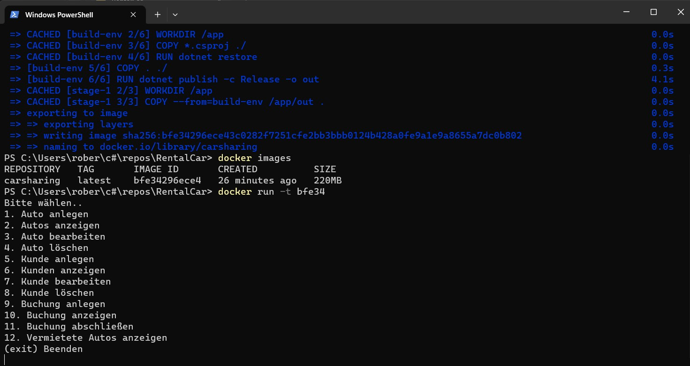
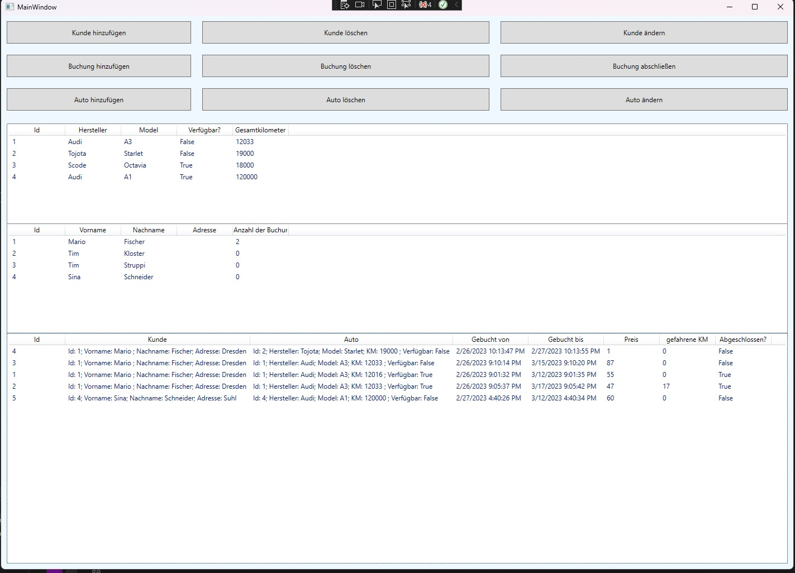

# RentalCar - kleines Tool für die Verwaltung eines Autoverleihs

Dies ist ein kleines Programm, zur Organisation eines Autoverleihs. Das Programm ermöglicht Mitarbeitern die Verwaltung von Autos, Buchungen und Kunden.

**Installation**
Um das Programm zu installieren, müssen Sie zuerst das Repository klonen:

`https://github.com/Rob183/RentalCar.git`

`cd RentalCar`

Als nächstes müssen Sie via Docker ein Image erstellen.

`docker build -t carsharing .`

Nun das zuletzt erstellte Image nehmen und..

`docker run -it <bfe34>` (<bfe34> ersetzen und passende ID des Images eingeben)

Das Programm wird über die Konsole gestartet.

Das Hauptmenü des Programms wird angezeigt. Von dort aus können Sie verschiedene Aktionen ausführen, 
einschließlich der Anzeige verfügbarer Autos, der Buchungungen und Anziege der Kunden.
Beim Starten des Programmes werden die Daten von einer externen NoSQL DB geladen.
  

 

So könnte eine GUI aussehen:
  

